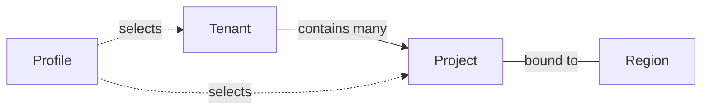

# IAM

## Concepts: profile, tenant, project, group, IAM

At a glance — a profile just selects which tenant/project you're acting as:




- **Profile** is purely local — a named entry in `~/.nebius/config.yaml` (CLI-side only, not a cloud resource). It stores how to authenticate (`auth-type`, e.g. `federation`) and a default `parent-id` (usually a project) so you don't have to pass `--parent-id`/`-p` on every command. Switch identities/projects with `-p <profile>` or `nebius profile activate`.
- **Tenant** is the top-level workspace — holds all projects, users, groups, quotas and billing. You cannot delete a tenant.
- **Project** isolates resources (VMs, K8s clusters, buckets, etc.); every region gets its own default project. Service accounts belong to exactly one project.


## Create and switch profiles

```bash
$ nebius profile create
Profile name: hj-tenant1-project1-eu-north1
Set api endpoint: api.nebius.cloud
Select authorization type: federation
✔ Set federation endpoint: auth.nebius.com█
Switch to your browser to complete the authentication process. If it didn't open automatically, use the following link: https://auth.nebius.com/oauth2/authorize?client_id=nebius-cli&code_challenge=RdXkxeSGVwXOCuW9f6UlpFOT6lfEsn0NFQFOwVeUa2c&code_challenge_method=S256&redirect_uri=http%3A%2F%2F127.0.0.1%3A39889&response_type=code&scope=openid&state=OnjEMHS~Kwv1bCWZYnWo2kCB9xy_s1jy
Choose Tenant ID to use as a default: tenant-e00n8mpcqrjw1ehff0
Choose Project ID (parent-id) to use as a default: project-e00bq3stpr009arc9j3hqq
profile "hj-tenant1-project1-eu-north1" configured and activated
```

Writes the result to `~/.nebius/config.yaml`, keyed by profile name:

```yaml
default: hj-tenant1-project1-eu-north1
profiles:
    hj-tenant1-project1-eu-north1:
        endpoint: api.nebius.cloud
        auth-type: federation
        federation-endpoint: auth.nebius.com
        parent-id: project-e00bq3stpr009arc9j3hqq
        tenant-id: tenant-e00n8mpcqrjw1ehff0
    profile-01:
        endpoint: api.nebius.cloud
        auth-type: federation
        federation-endpoint: auth.nebius.com
        parent-id: project-u00rpx09pr003ap0ehc79j
        tenant-id: tenant-e00n8mpcqrjw1ehff0
```

Switch between profiles with `nebius profile activate`:

```bash
$ nebius profile list
hj-tenant1-project1-eu-north1 [default]
profile-01

$ nebius profile active
hj-tenant1-project1-eu-north1

$ nebius profile activate
hj-tenant1-project1-eu-north1  profile-01

$ nebius profile activate profile-01
profile "profile-01" activated

$ nebius profile current
profile-01

$ nebius profile active
profile-01

$ nebius profile activate hj-tenant1-project1-eu-north1
profile "hj-tenant1-project1-eu-north1" activated
```

There's no `nebius profile describe` — `nebius profile active`/`current` give
the active profile's name, and full details come from
`~/.nebius/config.yaml` directly. `nebius profile list` marks the current
default with `[default]`.

## Get the active profile's tenant/project without reading the config file

```bash
$ nebius config get tenant-id
tenant-e00n8mpcqrjw1ehff0

$ nebius config get parent-id
project-e00bq3stpr009arc9j3hqq
```

## List and inspect tenants

```bash
nebius iam tenant list
```

```yaml
items:
  - metadata:
      id: tenant-e00n8mpcqrjw1ehff0
      parent_id: root-g00root
      name: hj-tenant1-zmn
      resource_version: "4"
      created_at: "2026-08-09T15:00:03.786056Z"
      updated_at: "2026-08-11T23:08:00.166328Z"
    spec:
      region: eu-north1
    status:
      suspension_state: NONE
      container_state: ACTIVE
      region: eu-north1
  - metadata:
      id: tenant-e00ks45pq37dm0yp0s
      parent_id: root-g00root
      name: white-leopon-tenant-cn8
      resource_version: "1"
      created_at: "2026-08-04T21:59:25.859703Z"
      updated_at: "2026-08-04T21:59:59.869510Z"
    spec:
      region: eu-north1
    status:
      suspension_state: SUSPENDED
      container_state: ACTIVE
      region: eu-north1
```

```bash
nebius iam tenant get --id tenant-e00n8mpcqrjw1ehff0
```

```yaml
metadata:
  id: tenant-e00n8mpcqrjw1ehff0
  parent_id: root-g00root
  name: hj-tenant1-zmn
  resource_version: "4"
  created_at: "2026-08-09T15:00:03.786056Z"
  updated_at: "2026-08-11T23:08:00.166328Z"
spec:
  region: eu-north1
status:
  suspension_state: NONE
  container_state: ACTIVE
  region: eu-north1
```

Subcommands must match exactly, and `--help`/`-h` only works once the
subcommand itself is valid:

```text
nebius iam tenent -h
Error: unknown command "tenent" for "nebius iam", did you mean "tenant" ?

To see available options, use:
    $ nebius iam --help
```

## List projects under a tenant

```bash
nebius iam project list --parent-id tenant-e00n8mpcqrjw1ehff0 --format table
```

```text
┌────────────────────────────────┬───────────────────────────┬─────────────────────────────┬─────────────────────────────┬─────────────────────────────┬─────────────────┐
│ METADATA.ID                    │ METADATA.PARENT_ID        │ METADATA.NAME               │ METADATA.CREATED_AT         │ METADATA.UPDATED_AT         │ METADATA.LABELS │
├────────────────────────────────┼───────────────────────────┼─────────────────────────────┼─────────────────────────────┼─────────────────────────────┼─────────────────┤
│ project-e00wtv1zpr00acf65jwg96 │ tenant-e00n8mpcqrjw1ehff0 │ default-project-eu-north1   │ 2026-08-09T15:00:08.457281Z │ 2026-08-11T23:07:47.061255Z │ {}              │
│ project-e01eekr0pr003k07q8fe8e │ tenant-e00n8mpcqrjw1ehff0 │ default-project-eu-west1    │ 2026-08-09T15:00:08.526677Z │ 2026-08-11T23:07:59.295255Z │ {}              │
│ project-e03x00bnpr00bftv17fx45 │ tenant-e00n8mpcqrjw1ehff0 │ default-project-uk-south1   │ 2026-08-09T15:00:08.515105Z │ 2026-08-11T23:07:54.841243Z │ {}              │
│ project-i00hgpq9pr001tqbpzbb0d │ tenant-e00n8mpcqrjw1ehff0 │ default-project-me-west1    │ 2026-08-09T15:00:08.628976Z │ 2026-08-11T23:07:54.296294Z │ {}              │
│ project-u00hgr6rpr00t4x43snme7 │ tenant-e00n8mpcqrjw1ehff0 │ default-project-us-central1 │ 2026-08-09T15:00:08.720020Z │ 2026-08-11T23:07:57.163793Z │ {}              │
│ project-u00rpx09pr003ap0ehc79j │ tenant-e00n8mpcqrjw1ehff0 │ hj-tenant1-project1         │ 2026-08-11T23:08:15.303078Z │ 2026-08-11T23:08:30.305830Z │ {}              │
└────────────────────────────────┴───────────────────────────┴─────────────────────────────┴─────────────────────────────┴─────────────────────────────┴─────────────────┘
```

`--format table` is a built-in CLI output formatter (`yaml|json|jsonpath|table|text`).

### Get a single project by ID

```bash
nebius iam project get --id project-u00rpx09pr003ap0ehc79j
```

```yaml
metadata:
  id: project-u00rpx09pr003ap0ehc79j
  parent_id: tenant-e00n8mpcqrjw1ehff0
  name: hj-tenant1-project1
  resource_version: "1"
  created_at: "2026-08-11T23:08:15.303078Z"
  updated_at: "2026-08-11T23:08:30.305830Z"
spec:
  region: us-central1
status:
  suspension_state: NONE
  container_state: ACTIVE
  region: us-central1
```

### Pick specific columns with `jsonpath`

```bash
nebius iam project list --parent-id tenant-e00n8mpcqrjw1ehff0 \
  --format 'jsonpath={range .items[*]}{.metadata.name}{"\t"}{.metadata.id}{"\n"}{end}'
```

### Get an OAuth access token

```bash
nebius iam get-access-token
<beaer token to access Nebius API, short-lived>
```


