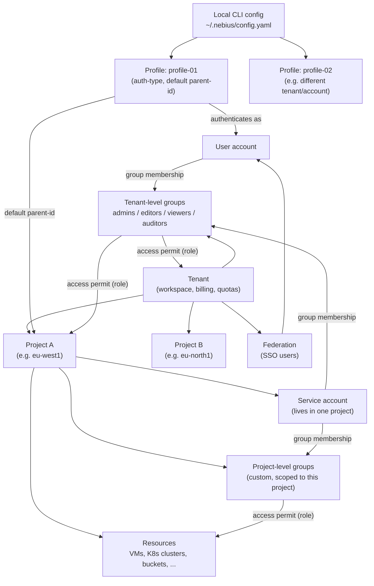

# Profiles & IAM

## Concepts: profile, tenant, project, group, IAM



- **Profile** is purely local — a named entry in `~/.nebius/config.yaml` (CLI-side only, not a cloud resource). It stores how to authenticate (`auth-type`, e.g. `federation`) and a default `parent-id` (usually a project) so you don't have to pass `--parent-id`/`-p` on every command. Switch identities/projects with `-p <profile>` or `nebius profile activate`.
- **Tenant** is the top-level workspace — holds all projects, users, groups, quotas and billing. You cannot delete a tenant.
- **Project** isolates resources (VMs, K8s clusters, buckets, etc.); every region gets its own default project. Service accounts belong to exactly one project.
- **Group** is how access is actually granted — a user or service account has **no access** to anything until it's added to a group. Groups can be tenant-wide (built-in `auditors` → `viewers` → `editors` → `admins`, least to most access) or custom/project-scoped for least-privilege access.
- **IAM** ties it together via **access permits**: a group is bound to a role at a given scope (tenant, project, or individual resource), which is what actually authorizes its members.

## Create a profile

```bash
nebius profile create
```

Walks through browser-based (federation) login and writes the result to
`~/.nebius/config.yaml`:

```yaml
default: profile-01
profiles:
    profile-01:
        endpoint: api.nebius.cloud
        auth-type: federation
        federation-endpoint: auth.nebius.com
        parent-id: project-u00rpx09pr003ap0ehc79j
```

## Inspect the active profile

```bash
nebius profile list      # all configured profiles
nebius profile active     # name of the active profile
nebius profile current    # active profile's full config
```

There's no `nebius profile describe` — full details come from
`nebius profile current` or by reading `~/.nebius/config.yaml` directly.

## List projects under a tenant

```bash
nebius iam project list --parent-id tenant-e00n8mpcqrjw1ehff0 --format table
```

```text
┌────────────────────────────────┬───────────────────────────┬─────────────────────────────┬─────────────────────────────┬─────────────────────────────┬─────────────────┐
│ METADATA.ID                    │ METADATA.PARENT_ID        │ METADATA.NAME               │ METADATA.CREATED_AT         │ METADATA.UPDATED_AT         │ METADATA.LABELS │
├────────────────────────────────┼───────────────────────────┼─────────────────────────────┼─────────────────────────────┼─────────────────────────────┼─────────────────┤
│ project-e00wtv1zpr00acf65jwg96 │ tenant-e00n8mpcqrjw1ehff0 │ default-project-eu-north1   │ 2026-08-09T15:00:08.457281Z │ 2026-08-11T23:07:47.061255Z │ {}              │
│ project-e01eekr0pr003k07q8fe8e │ tenant-e00n8mpcqrjw1ehff0 │ default-project-eu-west1    │ 2026-08-09T15:00:08.526677Z │ 2026-08-11T23:07:59.295255Z │ {}              │
│ project-e03x00bnpr00bftv17fx45 │ tenant-e00n8mpcqrjw1ehff0 │ default-project-uk-south1   │ 2026-08-09T15:00:08.515105Z │ 2026-08-11T23:07:54.841243Z │ {}              │
│ project-i00hgpq9pr001tqbpzbb0d │ tenant-e00n8mpcqrjw1ehff0 │ default-project-me-west1    │ 2026-08-09T15:00:08.628976Z │ 2026-08-11T23:07:54.296294Z │ {}              │
│ project-u00hgr6rpr00t4x43snme7 │ tenant-e00n8mpcqrjw1ehff0 │ default-project-us-central1 │ 2026-08-09T15:00:08.720020Z │ 2026-08-11T23:07:57.163793Z │ {}              │
│ project-u00rpx09pr003ap0ehc79j │ tenant-e00n8mpcqrjw1ehff0 │ hj-tenant1-project1         │ 2026-08-11T23:08:15.303078Z │ 2026-08-11T23:08:30.305830Z │ {}              │
└────────────────────────────────┴───────────────────────────┴─────────────────────────────┴─────────────────────────────┴─────────────────────────────┴─────────────────┘
```

`--format table` is a built-in CLI output formatter (`yaml|json|jsonpath|table|text`).

### Get a single project by ID

```bash
nebius iam project get --id project-u00rpx09pr003ap0ehc79j
```

### Pick specific columns with `jsonpath`

```bash
nebius iam project list --parent-id tenant-e00n8mpcqrjw1ehff0 \
  --format 'jsonpath={range .items[*]}{.metadata.name}{"\t"}{.metadata.id}{"\n"}{end}'
```

### Get an OAuth access token

```bash
nebius iam get-access-token
<beaer token to access Nebius API, short-lived>
```


